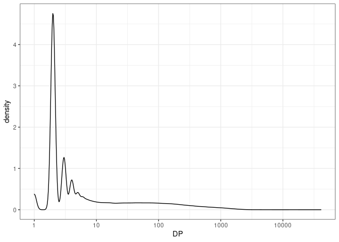
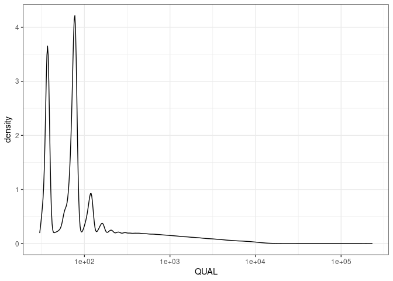
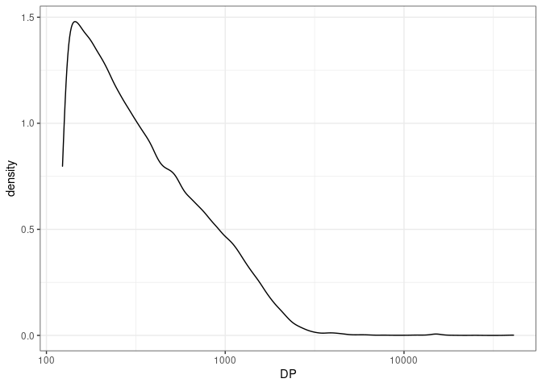
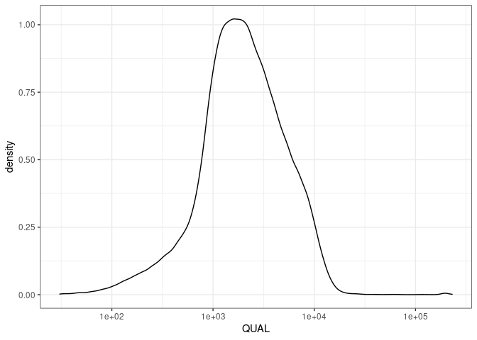

PRJEB5259 DP QUAL report
================
jlai
2022-05-14

## Data input

Data input should be merged vcf files from the variant calling pipeline
with snpeff annotations.

## Parse out information

We are interested in the depth (DP) and quality of variant sites.

``` r
dp <- parse_info(in.vcf, "DP") %>% as.integer()
plot.df <- in.vcf %>% transmute(QUAL = X6, DP = dp)
```

## Visualize distributions

``` r
ggplot(plot.df,
       aes(x = DP)) +
  geom_density() +
  scale_x_continuous(trans = "log10") +
  theme_bw()
```

<!-- -->

``` r
ggplot(plot.df,
       aes(x = QUAL)) +
  geom_density() +
  scale_x_continuous(trans = "log10") +
  theme_bw()
```

<!-- -->

Observe that large majority of reads have very small DP. Let’s see what
the quantiles look like.

``` r
quantile(plot.df$DP, seq(0,1,.1)) 
```

    ##    0%   10%   20%   30%   40%   50%   60%   70%   80%   90%  100% 
    ##     1     2     2     2     2     3     4     8    30   122 40989

``` r
quantile(plot.df$QUAL, seq(0,1,.1))
```

    ##        0%       10%       20%       30%       40%       50%       60%       70% 
    ##     30.05     37.32     37.32     61.32     73.32     78.28     78.32    119.84 
    ##       80%       90%      100% 
    ##    242.64    843.60 230350.00

The percentile of DP that resembles some useful depth to use (arbitrary,
but we don’t want something like 10 or so) is 90% percentile of the
data.

Apply filter to retain the top 10% of DP.

``` r
dp_cutoff <- quantile(plot.df$DP, seq(0,1,.1))[10] # starting at 0%, 90% is the 10th element
plot.df <- plot.df %>% 
  filter(DP > dp_cutoff)
```

``` r
ggplot(plot.df,
       aes(x = DP)) +
  geom_density() +
  scale_x_continuous(trans = "log10") +
  theme_bw()
```

<!-- -->

``` r
ggplot(plot.df,
       aes(x = QUAL)) +
  geom_density() +
  scale_x_continuous(trans = "log10") +
  theme_bw()
```

<!-- -->

With the DP filter, the QUAL metric is now shifted to the right (from
the original data). Likely, we do not need to apply any further filters,
as the minimum is \~30 (1 in 30 chance of a false result).
